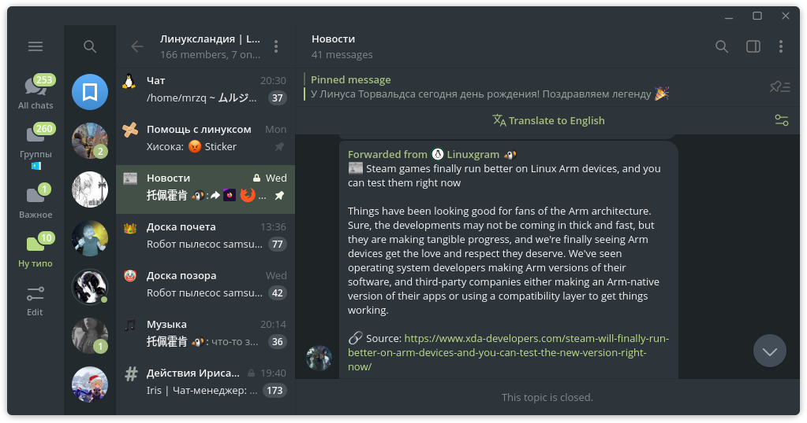

# telegram-everforest

## Installation

  1. Download the .tdesktop-theme file and import it inside the app

  Or, alternatively just add it via the link
  
  https://t.me/addtheme/everforestdarkmedium

  screenshot if u really want
  

sorry for crappy readme
