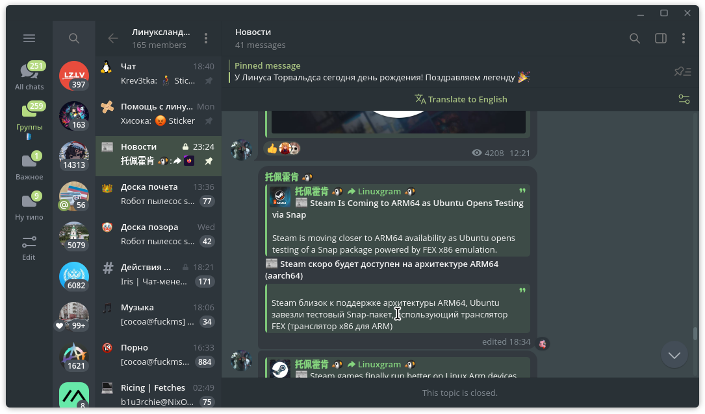

# telegram-everforest

## Installation

  1. Install the .tdesktop-theme file and import it inside the app

  Or, alternatively

  2. Just click on the link

  https://t.me/addtheme/everforestdarkmedium

  screenshot if u really want
  
